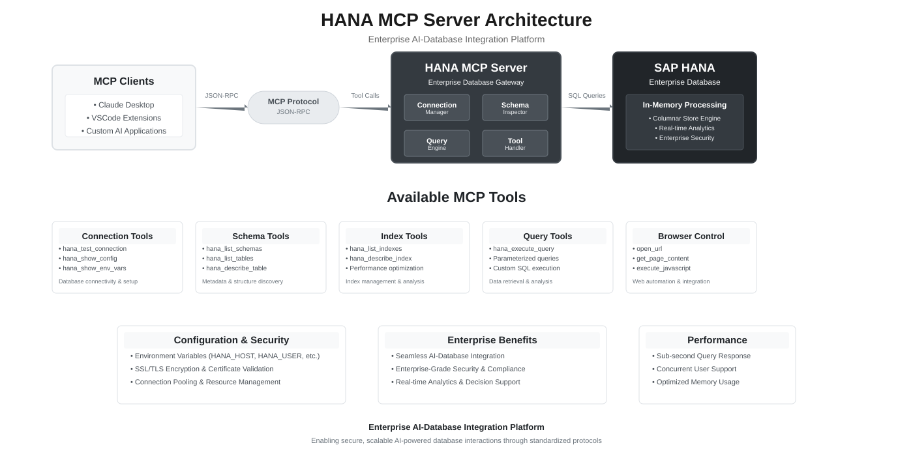

# SAP HANA MCP Server

[](https://www.npmjs.com/package/hana-mcp-server)
[](https://www.npmjs.com/package/hana-mcp-server)
[](https://nodejs.org/)
[](LICENSE)
[](https://modelcontextprotocol.io/)

**SAP HANA MCP Server** implements the [Model Context Protocol](https://modelcontextprotocol.io/) for **SAP HANA** and **SAP HANA Cloud**. AI clients discover schema, run SQL with guardrails, and optionally merge **business/domain metadata** so agents interpret codes and tables consistently—without replacing your database as the system of record.

---

## 📚 Documentation

| Document | Purpose |
|----------|---------|
| This README | Prerequisites, install, **how to wire each client**, capability summary, configuration cheat sheet, troubleshooting |
| [CHANGELOG.md](CHANGELOG.md) | **Release history** — features and fixes by version (latest `0.3.1`) |
| [docs/README.md](docs/README.md) | Index of `/docs` |
| [docs/ENVIRONMENT.md](docs/ENVIRONMENT.md) | **Authoritative** env reference: every variable, defaults, **hard bounds**, HTTP auth, security notes |
| [docs/configuration-samples.md](docs/configuration-samples.md) | **Copy-paste**: connection profiles (single-container, MDC), semantics JSON, paging pointers |
| [docs/local-http-mcp.md](docs/local-http-mcp.md) | Local **HTTP** MCP: `npm run start:http`, Cursor `mcp.json`, curl smoke checks |

---

## ✅ Prerequisites

- **Node.js** 18+
- A **SAP HANA** or **SAP HANA Cloud** database reachable on the SQL port from the machine running the server
- An **MCP client** (Claude Desktop, Claude Code, VS Code, Cursor, Cline, Windsurf, or custom HTTP client)
- **Credentials** supplied via env (see [Security](#security))

---

## 📦 Installation

| Method | Use when |
|--------|----------|
| `npx` + `-y hana-mcp-server` in MCP config | **Default** — no global install |
| `npm install -g hana-mcp-server` | You need `hana-mcp-server` on `PATH` |
| Clone + `node hana-mcp-server.js` | Developing or pinning a local build |

**HTTP entrypoint** (from a clone): `npm run start:http` — default bind `127.0.0.1:3100`, path `/mcp`. See [Hosted & HTTP](#-hosted--http).

---

## 🎯 Use cases

| Audience | Transport | Next step |
|----------|-----------|-----------|
| Chat / lite users | stdio | [Claude Desktop](#-claude-desktop) |
| Developers (Claude Code, VS Code, Cline, Cursor, Windsurf) | stdio | [IDEs & code agents](#-ides--code-agents) |
| Business apps with AI agents (you host MCP over HTTP) | HTTP | [Hosted & HTTP](#-hosted--http) |

---

## 🖥️ Claude Desktop

1. Config file path:
   - **macOS:** `~/Library/Application Support/Claude/claude_desktop_config.json`
   - **Windows:** `%APPDATA%\claude\claude_desktop_config.json`
   - **Linux:** `~/.config/claude/claude_desktop_config.json`

2. Register the server; put connection settings in `env` (see [Configuration](#configuration); full profile JSON in [configuration-samples.md](docs/configuration-samples.md)). The example below includes **`HANA_INSTANCE_NUMBER`** / **`HANA_DATABASE_NAME`** for **MDC**—remove them if you use a single-container database.

```json
{
  "mcpServers": {
    "HANA Database": {
      "command": "npx",
      "args": ["-y", "hana-mcp-server"],
      "env": {
        "HANA_HOST": "your-hana-host.com",
        "HANA_PORT": "443",
        "HANA_USER": "your-username",
        "HANA_PASSWORD": "your-password",
        "HANA_SCHEMA": "your-schema",
        "HANA_SSL": "true",
        "HANA_ENCRYPT": "true",
        "HANA_VALIDATE_CERT": "true",
        "HANA_CONNECTION_TYPE": "auto",
        "HANA_INSTANCE_NUMBER": "10",
        "HANA_DATABASE_NAME": "HQQ",
        "LOG_LEVEL": "info",
        "ENABLE_FILE_LOGGING": "true",
        "ENABLE_CONSOLE_LOGGING": "false"
      }
    }
  }
}
```

If the CLI is on `PATH`, you may use `"command": "hana-mcp-server"` and omit `args`.

3. Restart Claude Desktop.


## 💻 IDEs & code agents

**stdio** only; same `env` keys as above. **Canonical example — Claude Code** (`~/.claude.json` or project `.mcp.json`). The `env` block below includes **`HANA_DATABASE_NAME`** for **MDC tenant** HANA; omit it for most single-container setups.

```json
{
  "mcpServers": {
    "hana": {
      "type": "stdio",
      "timeout": 600,
      "command": "npx",
      "args": ["-y", "hana-mcp-server"],
      "env": {
        "HANA_HOST": "<host>",
        "HANA_PORT": "31013",
        "HANA_USER": "<user>",
        "HANA_PASSWORD": "<password>",
        "HANA_SCHEMA": "SAPABAP1",
        "HANA_DATABASE_NAME": "HQQ",
        "HANA_SSL": "false",
        "HANA_ENCRYPT": "false",
        "HANA_VALIDATE_CERT": "false",
        "LOG_LEVEL": "info",
        "ENABLE_FILE_LOGGING": "true",
        "ENABLE_CONSOLE_LOGGING": "false"
      }
    }
  }
}
```

Use the same `command`, `args`, and `env` in VS Code, Cline, Cursor, and Windsurf. After any change to `env`, restart the MCP server connection in the IDE.

---

## 🌐 Hosted & HTTP

Run the HTTP transport **from a checkout of this repository** (after `npm install`). The published `npx hana-mcp-server` path is **stdio** only.

```bash
npm run start:http
```

**Cursor / local IDE over HTTP:** set `HANA_*` in the shell (or process manager) that runs `start:http`, then add an HTTP MCP entry with `url` `http://127.0.0.1:3100/mcp` (`"type": "fetch"` or `"type": "http"`, depending on Cursor version). See [docs/local-http-mcp.md](docs/local-http-mcp.md) and `./scripts/start-http-mcp.sh`.

| Topic | Detail |
|--------|--------|
| Endpoint | `POST` JSON-RPC to `/mcp` (default base `http://127.0.0.1:3100`) |
| Tuning | `MCP_HTTP_HOST`, `MCP_HTTP_PORT` |
| Health | `GET /health` → `200` |
| CORS | `MCP_HTTP_ALLOWED_ORIGINS` — [ENVIRONMENT.md §7](docs/ENVIRONMENT.md#7-http-transport-npm-run-starthttp) |

### Optional Bearer JWT (OAuth2 / OIDC)

| Variable | Role |
|----------|------|
| `MCP_HTTP_AUTH_ENABLED` | `true` → require `Authorization: Bearer <token>` on `POST /mcp` |
| `MCP_HTTP_JWT_ISSUER` | Issuer / JWKS (omit on **SAP BTP** with bound XSUAA) |
| `MCP_HTTP_JWT_AUDIENCE` | Optional expected `aud` |
| `MCP_HTTP_JWT_SCOPES_REQUIRED` | Optional scope list |

**SAP BTP:** bind XSUAA, `MCP_HTTP_AUTH_ENABLED=true`, assign role collections. Details: [ENVIRONMENT.md §7](docs/ENVIRONMENT.md#7-http-transport-npm-run-starthttp).

---

## 🔒 Security

- **Secrets:** `HANA_PASSWORD`, JWT material, and URLs with embedded credentials belong in env or a secret manager — not in git.
- **Supply chain:** Prefer **`npx -y`** from the published package in CI and shared desktops instead of a mutable global install.
- **HTTP:** Enable JWT validation for anything beyond localhost; put the service behind a reverse proxy for TLS termination and network policy.

Further notes: [ENVIRONMENT.md §9](docs/ENVIRONMENT.md#9-security-notes).

---

## 🎯 Capabilities

**43 tools** across seven areas, all verified on HANA Cloud.

| Area | Tools | What you get |
|------|-------|--------------|
| **Connection & config** | `hana_show_config` `hana_test_connection` `hana_show_env_vars` `hana_get_session_info` | Verify connectivity, inspect configuration, see current user / schema / database / version |
| **Schema browsing** | `hana_list_schemas` `hana_list_tables` `hana_describe_table` `hana_explain_table` `hana_search_tables` `hana_search_columns` | Paginated schema/table lists, column metadata, cross-schema search, optional business-meaning overlay |
| **SQL execution** | `hana_execute_query` `hana_query_next_page` | Parameterized SQL with optional row/column/cell caps, paging (`maxRows`/`offset`/`includeTotal`), and snapshot continuation |
| **Structural analysis** | `hana_list_constraints` `hana_list_foreign_keys` `hana_list_indexes` `hana_describe_index` `hana_list_views` `hana_describe_view` `hana_list_synonyms` `hana_list_privileges` `hana_get_ddl` | PK/UK/FK/check constraints, indexes, views with SQL definition, synonyms, effective privileges, CREATE statement DDL |
| **Code objects** | `hana_list_procedures` `hana_describe_procedure` `hana_list_functions` `hana_describe_function` `hana_list_calculation_views` `hana_list_sequences` | Stored procedures, scalar/table functions, SAP BW/S4 calculation views (`_SYS_BIC`), sequences |
| **Data & performance** | `hana_get_table_stats` `hana_get_sample_data` `hana_get_column_stats` `hana_explain_plan` `hana_get_dependencies` `hana_get_partition_info` `hana_get_expensive_queries` | Row counts, sample rows, distinct/null stats, query execution plan, object dependency graph, partition info, top expensive statements |
| **Health & monitoring** | `hana_health_check` `hana_memory_monitor` `hana_realtime_performance` | Database health reports, indexserver memory snapshots with allocation-limit alerts, live performance indicators (open transactions, hot queries, long connections, column-store deltas, blocked transactions) |
| **DML guard** | — | INSERT / UPDATE / DELETE / TRUNCATE **blocked by default**; opt-in individually via `HANA_ALLOW_INSERT` / `HANA_ALLOW_UPDATE` / `HANA_ALLOW_DELETE` |
| **Resources** | `hana:///schemas` `hana:///schemas/{s}/tables/{t}` | MCP resource URIs for schema and table enumeration; `truncated` flag on large payloads |
| **Domain knowledge** | via `hana_explain_table` | Optional JSON semantics overlay (table descriptions, column meanings, code-value maps) — [configuration-samples.md](docs/configuration-samples.md) |

---

## 🛠️ Configuration

Variables apply to **stdio** (`env` in the client config) and **HTTP** (process environment). **Restart** after changes.

**Source of truth for names, defaults, and clamp ranges:** [docs/ENVIRONMENT.md](docs/ENVIRONMENT.md).  
**Copy-paste connection JSON (single-container / MDC):** [docs/configuration-samples.md#connection-profiles-env-json](docs/configuration-samples.md#connection-profiles-env-json).

### Required

| Parameter | Description | Example |
|-----------|-------------|---------|
| `HANA_HOST` | Hostname or IP | `hana.company.com` |
| `HANA_USER` | Database user | `DBADMIN` |
| `HANA_PASSWORD` | Database password | *(secret)* |

### Connection & TLS

| Parameter | Default | Notes |
|-----------|---------|--------|
| `HANA_PORT` | `443` | MDC SQL ports often `3NN13` (e.g. `31013`) |
| `HANA_SCHEMA` | — | Default when a tool omits `schema_name` |
| `HANA_CONNECTION_TYPE` | `auto` | `auto`, `single_container`, `mdc_system`, `mdc_tenant` |
| `HANA_INSTANCE_NUMBER` | — | MDC instance id (e.g. `10`) |
| `HANA_DATABASE_NAME` | — | **Tenant** name for MDC (e.g. `HQQ`, `HQP`) — session database only |
| `HANA_SSL` / `HANA_ENCRYPT` / `HANA_VALIDATE_CERT` | `true` | TLS and cert validation flags for the driver |

### Logging

| Parameter | Default | Notes |
|-----------|---------|--------|
| `LOG_LEVEL` | `info` | `error` … `debug` |
| `ENABLE_FILE_LOGGING` | `false`* | `true` enables file logs |
| `ENABLE_CONSOLE_LOGGING` | `true` | Often `false` for stdio to reduce stderr noise |

\*Code default; examples frequently set file logging to `true`.

### Limits (queries, lists, resources)

| Parameter | Default | Purpose |
|-----------|---------|---------|
| `HANA_QUERY_LIMITS_ENABLED` | `false` | Set to `true` to enable automatic row/column/cell caps. When `false`, user-provided `maxRows`, `offset`, and `includeTotal` still work. |
| `HANA_QUERY_TIMEOUT_MS` | `0` | Statement timeout (ms); `0` = disabled. Per-call `timeout_ms` overrides. |
| `HANA_MAX_RESULT_ROWS` | `50` | Max rows per `hana_execute_query` page (active when limits enabled) |
| `HANA_MAX_RESULT_COLS` | `50` | Max columns per row returned (active when limits enabled) |
| `HANA_MAX_CELL_CHARS` | `200` | Truncate long cell text (active when limits enabled) |
| `HANA_QUERY_DEFAULT_OFFSET` | `0` | Default `offset` (active when limits enabled) |
| `HANA_LIST_DEFAULT_LIMIT` | `200` | List tools: default and max page size |
| `HANA_RESOURCE_LIST_MAX_ITEMS` | `500` | Cap embedded names in `hana:///` payloads |
| `HANA_QUERY_SNAPSHOT_TTL_MS` | `300000` | Snapshot id lifetime for query paging |
| `HANA_CONNECTION_POOL_SIZE` | `3` | HANA connection pool size (1–20) |

### DML permissions

INSERT, UPDATE, and DELETE are **blocked by default**. Set each to `true` to permit:

| Parameter | Default | Purpose |
|-----------|---------|---------|
| `HANA_ALLOW_INSERT` | `false` | Permit `INSERT` via `hana_execute_query` |
| `HANA_ALLOW_UPDATE` | `false` | Permit `UPDATE` via `hana_execute_query` |
| `HANA_ALLOW_DELETE` | `false` | Permit `DELETE` and `TRUNCATE` via `hana_execute_query` |

### Business / domain JSON (`HANA_SEMANTICS_*`)

| Parameter | Default | Purpose |
|-----------|---------|---------|
| `HANA_SEMANTICS_PATH` | — | File path to dictionary JSON (wins over URL) |
| `HANA_SEMANTICS_URL` | — | HTTPS URL to same format |
| `HANA_SEMANTICS_TTL_MS` | `60000` | Cache / reload behavior |

Samples: [configuration-samples.md](docs/configuration-samples.md).

---

## 🔧 Troubleshooting

| Symptom | Check |
|---------|--------|
| `spawn npx ENOENT` / `spawn hana-mcp-server ENOENT` in client logs | Client cannot find `npx` / `hana-mcp-server` on `PATH` — see [Client cannot find `npx`](#client-cannot-find-npx-spawn-enoent) below |
| Connection refused | `HANA_HOST`, `HANA_PORT`, network path |
| Auth failed / no client | Password, user, **`HANA_DATABASE_NAME`** on tenants; use connection test tool for driver message |
| TLS errors | `HANA_VALIDATE_CERT`, trust store |
| Wrong or empty objects | MDC: tenant drives visibility; identical schema names can differ by tenant |
| SQL needs another database prefix | `hana_execute_query` does not rewrite SQL; use the three-part names your HANA expects (e.g. `HSP.SAPABAP1.TABLE`) while `HANA_DATABASE_NAME` stays the tenant you connect to (e.g. `HQP`) |

**Debug:** `LOG_LEVEL=debug`, `ENABLE_CONSOLE_LOGGING=true`, restart.

### Client cannot find `npx` (`spawn ENOENT`)

GUI clients launched from the Dock or Start Menu (Claude Desktop, Cursor, VS Code, …) inherit a minimal `PATH` and may not see Node tooling installed under `/opt/homebrew/bin`, `~/.nvm/...`, `mise`, or `volta`. This affects **every** `npx`-based MCP, not just this server. The error appears in MCP client logs as:

```text
Connection failed: spawn npx ENOENT
```

Pick **one** fix:

1. **Symlink `npx` / `node` into a GUI-visible path** (macOS, Homebrew):

   ```bash
   ln -s "$(which npx)"  /usr/local/bin/npx
   ln -s "$(which node)" /usr/local/bin/node
   ```

2. **Use absolute paths in the MCP config** — most portable, no `PATH` dependency. Resolve paths with `which node` and `npm root -g`:

   ```json
   {
     "mcpServers": {
       "hana": {
         "type": "stdio",
         "command": "/opt/homebrew/bin/node",
         "args": ["/opt/homebrew/lib/node_modules/hana-mcp-server/hana-mcp-server.js"],
         "env": { "HANA_HOST": "...", "HANA_USER": "...", "HANA_PASSWORD": "..." }
       }
     }
   }
   ```

   Requires a one-time `npm install -g hana-mcp-server`.

3. **Inject `PATH` into the MCP `env` block** — keeps the `npx` form:

   ```json
   "env": {
     "PATH": "/opt/homebrew/bin:/usr/local/bin:/usr/bin:/bin",
     "HANA_HOST": "...",
     "HANA_USER": "...",
     "HANA_PASSWORD": "..."
   }
   ```

Restart the MCP client after the change. If `npx` then fails with `EPERM` on `~/.npm/_cacache`, the npm cache has root-owned files from a previous `sudo npm` — fix with `sudo chown -R "$(whoami)" ~/.npm` or set `"NPM_CONFIG_CACHE": "/tmp/hana-mcp-npm-cache"` in the same `env` block.

---

## 🏗️ Architecture



```text
hana-mcp-server/
├── src/
│   ├── server/           # MCP lifecycle, resources, HTTP transport
│   ├── tools/            # 34 tools: schema, SQL, discovery, config
│   ├── database/         # HANA client, connection pool, executor, query runner
│   ├── semantics/        # Optional semantics / domain JSON loader
│   ├── utils/            # Logger, config, validators, formatters
│   ├── query-snapshot-store.js
│   └── constants/        # MCP constants, tool definitions
├── tests/
├── docs/                 # README index, ENVIRONMENT.md, configuration-samples.md, diagrams
└── hana-mcp-server.js    # stdio entry point
```

---

## 📦 Package

| | |
|--|--|
| **Runtime** | Node.js 18+ |
| **Platforms** | macOS, Linux, Windows |
| **Dependencies** | `@sap/hana-client`, `axios`, `jose` |

---

## 🤝 Support

- **Issues:** [GitHub Issues](https://github.com/hatrigt/hana-mcp-server/issues)
## 📄 License

Proprietary — see [LICENSE](LICENSE) (End User License Agreement).
